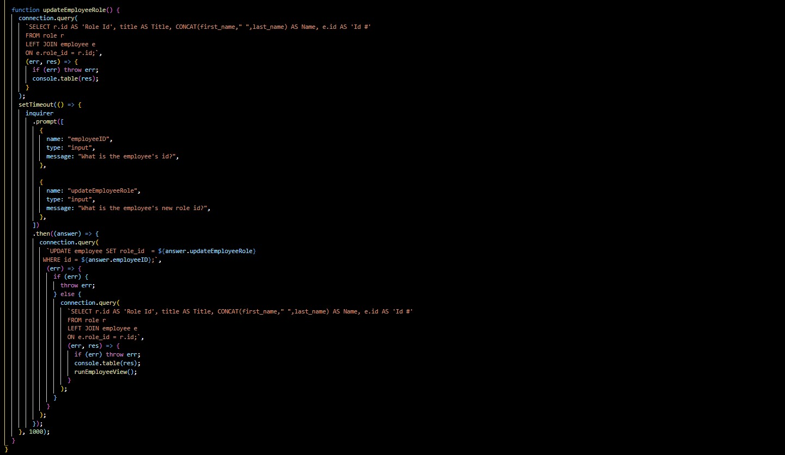

# Employee Tracker Using MySQL

## Overview

As a business owner, I want to be able to view and manage the deparments, role and employees in my company, so that I
can organize and plan my business.

## Table of Contents

- [Description](#description)
- [Installation](#installation)
- [Usage](#usage)
- [Test](#test)
- [Demo](#demo)
- [Tools](#tools)
- [Research](#research)
- [Questions](#questions)
- [License](#license)

## Description

To dynamically and quickly access a database, inquirer, console.table npm, and MySQL were utilized to:

- Serve and display a working data base.
- The user's input was gathered and used to create, retrieve, update and delete data from the database.

## Installation

1. Create a .gitignore file and include node_modules and .DS store. This ensures that the node_modules directory isn't
   tracked or uploaded to GitHub.
2. Use the command-line, npm i to install console.table npm, inquirer - npm, asciiargt-logo - npm and mysql npm.
3. To start the inquirer prompts to connect the the database, use the command, node index.js.

## Usage

- inquirer npm and console.table npm were used to retrieve and display data to the the user from the database
- Once the user's information regarding:
  - employee's first and last name, role id, salary, department id, department name, manager id:
- An employee, department and role can be saved/retrieved/updated and respective id is created/assigned.

## Test

Test the schema.sql by using the seed.sql in the MySQL Workbench.

## Demo

- \*[demo video](https://drive.google.com/file/d/1wWOHtfEHdHWPyeBJ-lxRB2ZVvsMhdnlk/view)
- \*[GitHub Repository](https://github.com/Kay0s/MySQLEmployeeTracker)

### Screenshot of the updateEmployeeRole Function

## Tools

- JavaScript
- MySQL
- console.table npm
- .gitignore
- Git Bash
- node.js
- inquirer - npm
- asciiargt-logo - npm

## Research

- [Documentation - MySQL](https://dev.mysql.com/)
- [console.table npm](https://www.npmjs.com/package/console.table)
- [ASCII-art Logo npm](https://www.npmjs.com/package/asciiart-logo)
- [mysql npm](https://www.npmjs.com/package/mysql)
- [SQLBolt](https://sqlbolt.com/)

## Questions

- [Email](hamilton.kristina@gmail.com)
- [GitHub Profile](https://github.com/Kay0s)
- [GitHub Repository](https://github.com/Kay0s/MySQLEmployeeTracker)

## License

© 2021 Kristina Hamilton and Trilogy Education Services, a 2U, Inc. brand. All Rights Reserved. Permission is hereby
granted, free of charge, to any person obtaining a copy of this software and associated documentation files (the
"Software"), to deal in the Software without restriction, including without limitation the rights to use, copy, modify,
merge, publish, distribute, sublicense, and/or sell copies of the Software, and to permit persons to whom the Software
is furnished to do so, subject to the following conditions:

The above copyright notice and this permission notice shall be included in all copies or substantial portions of the
Software.

THE SOFTWARE IS PROVIDED "AS IS", WITHOUT WARRANTY OF ANY KIND, EXPRESS OR IMPLIED, INCLUDING BUT NOT LIMITED TO THE
WARRANTIES OF MERCHANTABILITY, FITNESS FOR A PARTICULAR PURPOSE AND NONINFRINGEMENT. IN NO EVENT SHALL THE AUTHORS OR
COPYRIGHT HOLDERS BE LIABLE FOR ANY CLAIM, DAMAGES OR OTHER LIABILITY, WHETHER IN AN ACTION OF CONTRACT, TORT OR
OTHERWISE, ARISING FROM, OUT OF OR IN CONNECTION WITH THE SOFTWARE OR THE USE OR OTHER DEALINGS IN THE SOFTWARE.
